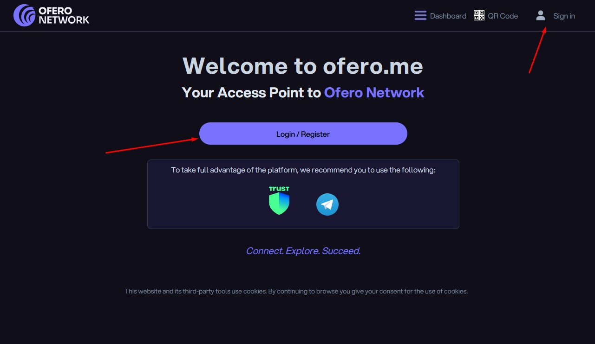

# Registering on Ofero.me

#### Step 1: Create Your Account

1. Visit [**Ofero Network's main platform (ofero.me)**](https://ofero.me).
2. **Click on "Login/Register"**
3. **Enter Your Email Address.**
4. **Verify Your Email**
   * A verification code will be sent to your email. Check your inbox (or spam folder) and enter the code on the website.
5. **Set Up Your Account**
   * Choose a unique username.
   * Complete your personal details, including name and e-mail address.

<figure><figcaption></figcaption></figure>

## **Optional Details**

You can use placeholder information for your personal details (e.g., a fake name or date of birth). However, accounts with inaccurate details:

* Cannot achieve validation status (marked with a green checkmark).
* May face limitations in accessing services provided by Ofero Network’s partners.

**Note:** All details can be updated later from your account settings.

### Need Help?

If you encounter any issues or have questions, visit our **Support Center** or contact us directly at **info@ofero.network**

Congratulations! You're now ready to explore the full potential of Ofero Network. Dive into the features, make connections, and enjoy the journey!
